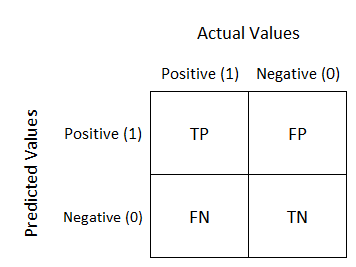
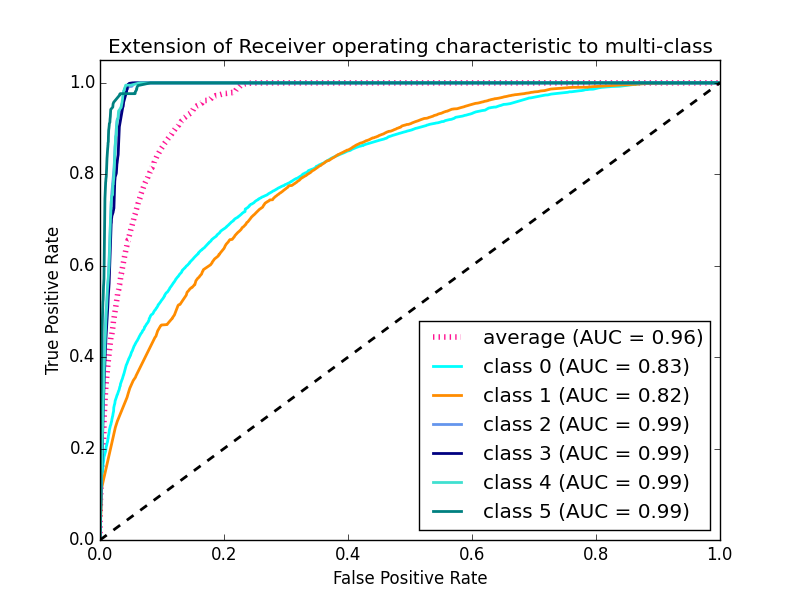

# 🏦 Loan Approval Prediction System (ML + Web App)

🚀 **Live Demo:** https://your-app-name.streamlit.app

---

## 📌 Overview

This project predicts whether a loan application will be approved or not using Machine Learning techniques. It analyzes applicant details such as income, credit history, loan amount, and other features to make accurate predictions.

This project is implemented as an **end-to-end ML system**, including:

* Data preprocessing
* Model training & evaluation
* Deployment as a **Streamlit web application**

---

## 🚀 Features

* Data preprocessing and cleaning
* Multiple Machine Learning models implemented:

  * Logistic Regression
  * Decision Tree
  * Random Forest
  * XGBoost
* Model comparison and evaluation
* Risk prediction analysis
* Interactive **web-based prediction system**
* User-friendly UI for real-time predictions

---

## 📊 Best Model Performance

* ✅ **Logistic Regression Accuracy: 78.47%**
* Evaluation Metrics:

  * Accuracy Score
  * Confusion Matrix
  * ROC Curve

---

## 🌐 Web Application

The project is deployed as a live web app using **Streamlit**.

### 🔹 Features of Web App:

* Interactive input form (all applicant details)
* Real-time loan prediction
* Input validation and error handling
* Clean and responsive UI
* Fast predictions using optimized model loading

---

## 🛠️ Tech Stack

* **Programming:** Python
* **Libraries:** Pandas, NumPy, Scikit-learn
* **Visualization:** Matplotlib, Seaborn
* **Deployment:** Streamlit
* **Tools:** Jupyter Notebook, VS Code

---

## 📂 Project Structure

```
loan-approval-prediction/
│── app.py                      # Streamlit web app
│── model.pkl                  # Trained ML model
│── requirements.txt           # Dependencies
│── loan-approval-prediction.ipynb
│── loan-approval-prediction-output.ipynb
│── datasets (.csv files)
│── visualizations (.jpg files)
│── README.md
```

---

## 📈 Visualizations

### Confusion Matrix



### ROC Curve



---

## 💡 Key Learnings

* Data preprocessing and feature engineering
* Handling categorical variables and encoding
* Model training, evaluation, and comparison
* Debugging real-world ML deployment issues
* Building and deploying an end-to-end ML system

---

## 🔮 Future Improvements

* Improve model accuracy with hyperparameter tuning
* Add probability-based predictions
* Integrate database for storing user inputs
* Enhance UI/UX for better user experience

---

## 👨‍💻 Author

**Ankit Raj**
